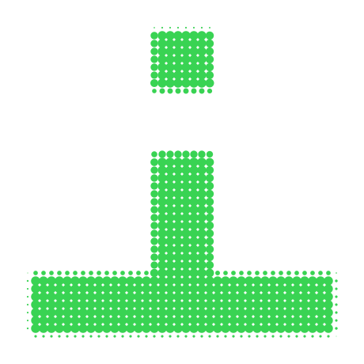

<div align="center">

<!-- PORTRAIT - dot-matrix render of the photo in assets/avatar.png, generated
     by scripts/dotify.py. Colour mode, so one file serves both themes.
     Regenerate after swapping the photo with:
       python scripts/dotify.py assets/avatar.png -o assets/portrait \
         --cols 100 --detail 0.5 --color --gap 0.05 --bg-cutoff 0.76 -->


<br>

<!-- NAME / TAGLINE - animated typing, with a binary easter egg -->
<a href="https://github.com/RohanKamal123">
  
</a>

<br>

<!-- SOCIALS -->
<a href="https://github.com/RohanKamal123"></a>
<a href="https://www.linkedin.com/in/tahsin-kamal-rohan-631842284"></a>
<a href="mailto:run.rohan778@gmail.com"></a>


</div>

---

## `~/` whoami

```console
$ cat about.txt
```

Hi, I'm **Tahsin Kamal Rohan** — a Data Science student who builds things that sit
between machine learning and the real world, and ships them in public.

- 🎓 B.Sc. in Data Science at **United International University (UIU)**, Bangladesh
- 🤖 Focused on **Artificial Intelligence**, **NLP**, and **Machine Learning**
- 🐍 Building end-to-end AI projects with **Python** and **PyTorch**
- 🌱 Currently exploring applied ML systems and shipping side projects
- 💡 Fun fact: **I started coding because I wanted to build things I wished existed.**

<br>

<div align="center">

## `~/` toolbox


</div>

---

<div align="center">

## `~/` the numbers

<!-- github-profile-summary-cards is self-maintained and reliably up, unlike the
     public github-readme-stats instance which frequently gets rate-limited. -->


<br>


<br>


<br>


</div>

---

<div align="center">

## `~/` contribution calendar

<!-- 3D isometric calendar, regenerated every 6h by .github/workflows/metrics.yml.
     Requires a METRICS_TOKEN repo secret - see the note at the bottom of this file. -->


<br><br>

<!-- Snake eats the contribution graph - .github/workflows/snake.yml -->
<picture>
  <source media="(prefers-color-scheme: dark)"  srcset="https://raw.githubusercontent.com/RohanKamal123/RohanKamal123/output/snake-dark.svg">
  <source media="(prefers-color-scheme: light)" srcset="https://raw.githubusercontent.com/RohanKamal123/RohanKamal123/output/snake.svg">
  
</picture>

</div>

---

<div align="center">

## `~/` selected work

<!-- Static table renders instantly and never depends on a third-party card
     service. Descriptions/stack pulled from each repo - edit freely. -->
<sub>

| project | what it is | stack |
|---|---|---|
| **[INTERPRETER&#95;WITH&#95;BRAIN](https://github.com/RohanKamal123/INTERPRETER_WITH_BRAIN)** | Stealth AI interview assistant | `React` `Vite` `Electron` `DeepSeek` |
| **[UIU-LostandFound](https://github.com/RohanKamal123/UIU-LostandFound)** | Lost &amp; Found system for the UIU campus | `Python` |
| **[CARE&#95;AI](https://github.com/RohanKamal123/CARE_AI)** | AI-assisted care/health web app | `JavaScript` |
| **[DailyAIChallenge](https://github.com/RohanKamal123/DailyAIChallenge)** | Daily AI / ML coding challenges | `Python` |

</sub>

</div>

---

<div align="center">

<sub>`01100001 01101100 01110111 01100001 01111001 01110011 00100000 01100010 01110101 01101001 01101100 01100100 01101001 01101110 01100111`</sub>

</div>
