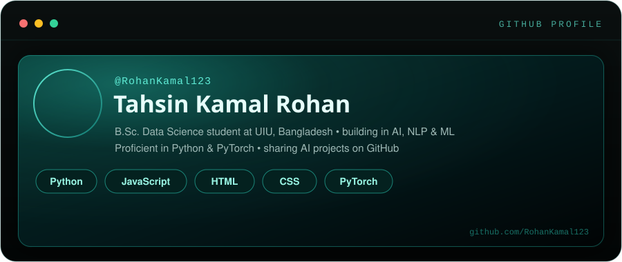

 

 

## 🧠 About Me

- 🎓 B.Sc. in Data Science student at **United International University (UIU)**, Bangladesh
- 🤖 Focused on **Artificial Intelligence**, **NLP**, and **Machine Learning**
- 🐍 Proficient in **Python** and **PyTorch**, building end-to-end AI projects
- 🌱 Currently exploring applied ML systems and shipping side projects in public
- 📫 Reach me by opening an issue or discussion on any of my repos

 

## 🛠️ Tech Stack

 

## 📊 GitHub Stats

 

## 📈 Contribution Activity

 

## 🚀 Featured Projects

 

